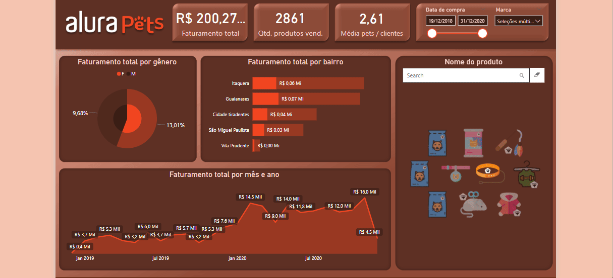

# Projeto Dashboard Petshop

Este projeto foi desenvolvido durante a formação Power BI na Alura, especificamente no curso "Power BI Desktop: construindo meu primeiro dashboard". O objetivo principal foi explorar o Power BI, uma ferramenta da Microsoft, e aprender sobre sua instalação, importação de datasets em diferentes formatos (.xls, .csv, Google Sheets, pastas do Excel, entre outros), além de aplicar as linguagens DAX e M para manipulação de dados. Por fim finalizar a criação de um dashboard visual.

### :computer: Projeto 

O dashboard foi construído para uma loja de petshop, permitindo uma visualização clara e objetiva dos principais KPIs de vendas e comportamento dos clientes

### :pushpin: Funcionalidades do projeto

- `Indicadores principais`: Exibe o faturamento total, quantidade de produtos vendidos e média de pets por cliente.
- `Gráfico de pizza`: Apresenta o faturamento total por gênero.
- `Gráfico de barras`: Mostra o faturamento por bairro, destacando as áreas com maiores vendas.
- `Gráfico de linhas`: Representa o faturamento ao longo do tempo, de janeiro de 2019 a dezembro de 2020.
- `Filtros dinâmicos`: Inclui filtros de data de compra e marca do produto, possibilitando uma análise mais refinada.
- `Busca por produtos`: Permite localizar produtos por título ou imagem, facilitando a navegação e a análise de dados específicos.

### :hammer: Tecnologias utilizadas

- `Power BI`
- `Excel`
- `Google Sheets`
- `DAX e M`

### :open_file_folder: Como abrir e rodar o projeto
1. Faça o download das bases de dados e do arquivo .pbix.
2. Abra o Power BI e carregue o arquivo .pbix na mesma pasta onde os datasets estão salvos.
3. O projeto estará pronto para ser visualizado e avaliado.

### :bulb: Contato
Se este projeto te ajudou, não esquece de me seguir! ✨ Fico super feliz em receber sugestões de melhorias ou dicas para continuar evoluindo! Pode me chamar no Linkedin ou mandar um e-mail, vou adorar conversar com você! 😊📩
- Email: rlarissa191@gmail.com
- Linkedin: https://www.linkedin.com/in/larissa-de-almeida-ribeiro-212214197/
